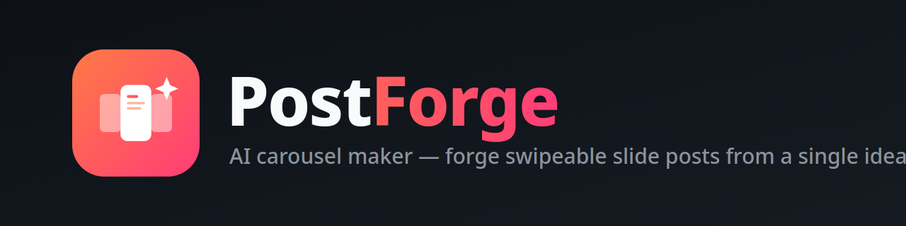
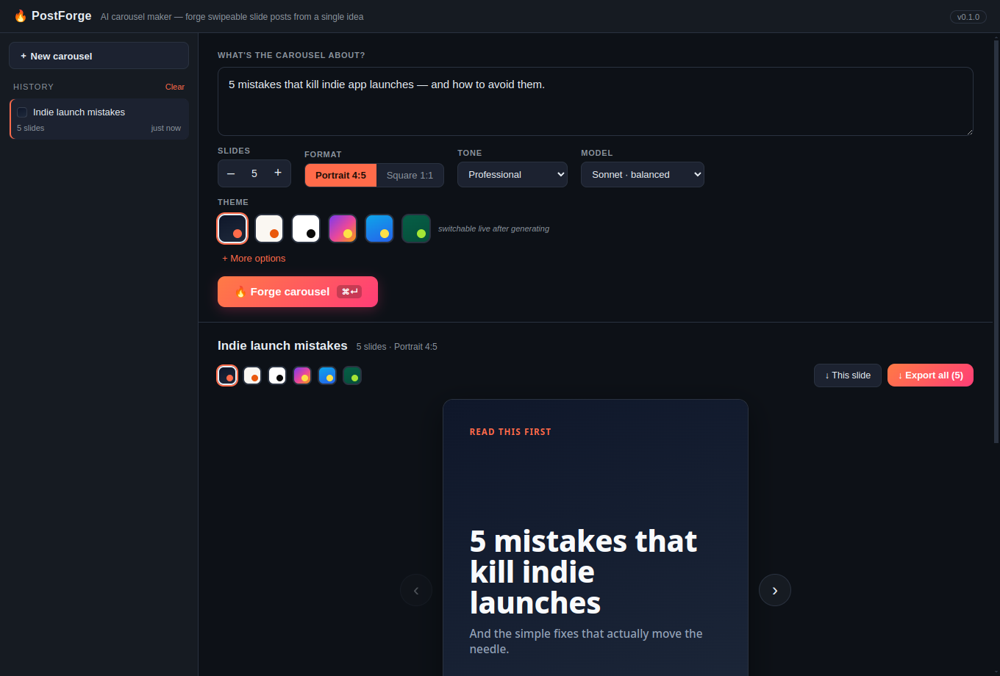

<p align="center">
  
</p>

<p align="center">
  An AI studio for forging swipeable social media <b>carousels</b> from a single idea —
  powered by the Claude Agent SDK, authed through your existing Claude Code login
  (no API key wrangling).
</p>

---

Describe your idea, set the slide count, format and tone, and PostForge designs a
full carousel — a cover hook, the substance slides, and a closing CTA. Pick from
six themes and **switch them live**, flip through the deck, edit, then export every
slide as a PNG (or the whole set as a zip).

<p align="center">
  
</p>

Same stack as [Squadron](https://github.com/RaihanStark/squadron): an Express
backend wrapping the Claude Agent SDK, a Vite + React frontend, all shipped as a
local Electron desktop app with auto-update.

## Features

- **Idea → carousel** — Claude writes structured slides (cover · point · list · quote · cta) plus a ready-to-post caption.
- **Live theming** — six themes (Midnight, Paper, Mono, Vibrant, Ocean, Forest); switch instantly without regenerating.
- **Formats** — Portrait 4:5 and Square 1:1, exported at 1080px.
- **PNG export** — per-slide or the whole deck zipped, rendered exactly as previewed.
- **Auto-update** — installed apps update themselves from GitHub Releases.

## Install

Grab the latest **AppImage** from the [Releases page](https://github.com/RaihanStark/postforge/releases/latest):

```bash
chmod +x PostForge-*.AppImage
./PostForge-*.AppImage
```

It checks for updates on launch and installs new versions in the background.

## Layout

```
electron/   Electron shell (starts the backend, opens the window, auto-update)
server/     Express API + Claude Agent SDK wrapper (the carousel designer)
web/        Vite + React frontend
assets/     Logo + marketing images
```

## Develop

```bash
npm run setup     # install root + web deps
npm run dev       # server (5174) + web (5173) with API proxy
```

Open http://localhost:5173. Add `?demo` to explore the UI against canned data
with no backend or Claude login required: http://localhost:5173/?demo

## Desktop app

```bash
npm run electron  # run the shell against the built web bundle
npm run dist      # build the AppImage installer + update metadata
```

## API

- `GET  /api/health` — liveness
- `GET  /api/version` — app version
- `GET  /api/meta` — formats, tones, slide range, version
- `POST /api/generate` — `{ topic, slideCount, format, tone, handle?, audience?, cta?, brandVoice?, model? }` → `{ title, slides[], caption, hashtags[] }`
